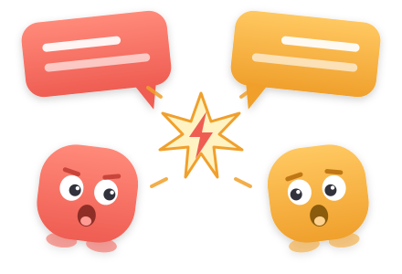

# skill-clash



> skill-doctor tells you what's unused. skill-clash tells you why.

Claude Code routes a prompt to a skill by reading each skill's `description`.
When two descriptions claim the same triggers, you cannot predict which one
runs. `skill-clash` reads every skill you have installed and tells you which
pairs fight over the same prompts — and on which words.

## Usage

```bash
npx skill-clash
```

```
skill-clash - 75 skills scanned, 13 clashes, 20 ambiguous

CLASH  0.91  access (plugin:discord) <-> access (plugin:telegram)
             "the user asks to pair" . "approve someone" . "check who's allowed"
CLASH  0.75  brainstorming <-> test-driven-development
             "design before implementation" . "implementing any feature"
CLASH  0.73  better-ui <-> impeccable
             "improves ui" . "polish" . "otherwise improve a frontend interface"
CLASH  0.60  agent-development <-> skill-development
             "needs guidance on agent structure" . "improve skill description"
AMBIG  0.38  impeccable <-> web-design-guidelines
             "audit" . "live browser iteration on UI elements" . "review my UI"
```

Which skills would compete for a specific prompt:

```bash
npx skill-clash --prompt "review my UI"
```

```
1. 0.70  web-design-guidelines
      "review my UI"
2. 0.50  frontend-design
      "building ui"
3. 0.50  karpathy-guidelines
      "reviewing"
```

Found a pair you need to decide about? `--explain` prints everything you need
to choose, and changes nothing:

```bash
npx skill-clash --explain better-ui impeccable
```

```
skill-clash - better-ui <-> impeccable  CLASH 0.73

Overlapping on:
  polishes, improves, ui

better-ui (user)
  ~/.claude/skills/better-ui/SKILL.md
  Polishes and improves the UI in your project. Covers concentric border
  radius, optical alignment, surface depth, contextual icons, hit areas.
  claims: "polishes improves" . "improves ui"
  only it: concentric, radius, optical, hit, areas

impeccable (user)
  ~/.claude/skills/impeccable/SKILL.md
  Use when the user wants to design, redesign, shape, critique, audit ...
  claims: "otherwise improve a frontend interface"
  only it: redesign, critique, distill, harden, colorize

Nothing was changed. To drop one, remove its directory yourself.
```

Let your own Claude judge the ambiguous pairs. It shells out to your `claude`
CLI — no API key, no account setup — and sends only the name and description
of each ambiguous pair, roughly 150 tokens per pair, nothing else:

```bash
npx skill-clash --deep
```

```
AMBIG  0.19  impeccable <-> threejs-shaders
             deep: distinct - Impeccable covers UI/UX design while threejs-shaders
                              is specifically GLSL/shader code for Three.js.
```

Shareable report with a collision matrix:

```bash
npx skill-clash --html report.html
```

## Flags

| Flag | Effect |
|---|---|
| `-p, --prompt <text>` | Rank skills competing for this prompt |
| `-e, --explain <a> <b>` | Show in detail why two named skills overlap |
| `--deep` | Ask `claude -p` for a verdict on ambiguous pairs |
| `--json` | Machine-readable output |
| `--html <file>` | Also write a standalone HTML report |
| `--strict` | Exit 1 on ambiguous pairs too |
| `--clash <n>`, `--ambiguous <n>` | Band thresholds (0–1) |
| `--no-plugins` | Skip skills shipped by plugins |
| `--home <dir>`, `--cwd <dir>` | Scan somewhere else |

Exit codes: `0` clean, `1` at least one clash (CI gate), `2` usage error.

## What it scans

- `~/.claude/skills/*/SKILL.md`
- `./.claude/skills/*/SKILL.md`
- `~/.claude/plugins/**/<plugin>/skills/*/SKILL.md`

Symlinked skill directories are followed, so dotfile setups and plugin
managers that link skills in are scanned too.

Only the `description` frontmatter field is analysed — that is all Claude Code
sees when it picks a skill.

## How scoring works

Explicit triggers are extracted from each description: quoted phrases, and
clauses after `use when` / `triggers on` / `when the user asks`. A skill with
no explicit triggers falls back to verb-object pairs.

Two skills are compared on the overlap of their trigger words (60%) and of
their whole description vocabulary (40%), using the overlap coefficient
(`|A∩B| / min(|A|,|B|)`) rather than Jaccard, so a short skill subsumed by a
long one still scores high. Scores ≥ 0.45 are a clash, ≥ 0.35 ambiguous.

Those thresholds are calibrated against a real ~75-skill install: 0.35 is the
tightest ambiguous value that still catches genuinely overlapping pairs, and
it yields 36 pairs where a 0.15 threshold yields 210.

No model, no network, no cost — unless you pass `--deep`.

## Known limits

- Ranking is by **declared** triggers, not topic. A skill that is obviously
  about UI but never says so in its description will rank low for `--prompt
  "review my UI"`. That is deliberate: it mirrors what Claude Code itself has
  to work from.
- Heuristics produce false positives. Two skills that describe the same
  *domain* in the same words can score high while doing unrelated jobs.
  `--deep` exists for exactly those cases.

## Not what this does

- Lint frontmatter or structure → use [claudelint](https://claudelint.com/)
- Show token cost or usage → use `/skill-doctor` in Claude Code
- **Remove or rewrite your skills.** It reports, you decide. A clash is not a
  defect: plenty of overlapping pairs are ones you want to keep, and the tool
  cannot know which half of a pair you meant to win. It prints the evidence and
  the file paths; deleting is a one-line command you run yourself, with your
  eyes on it.

## License

MIT
